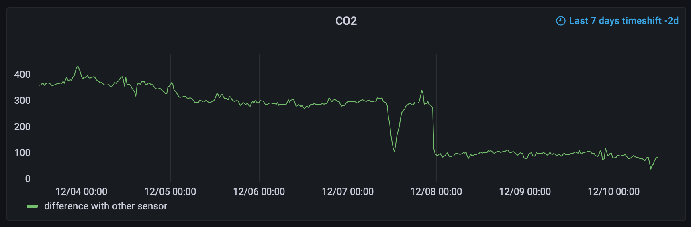
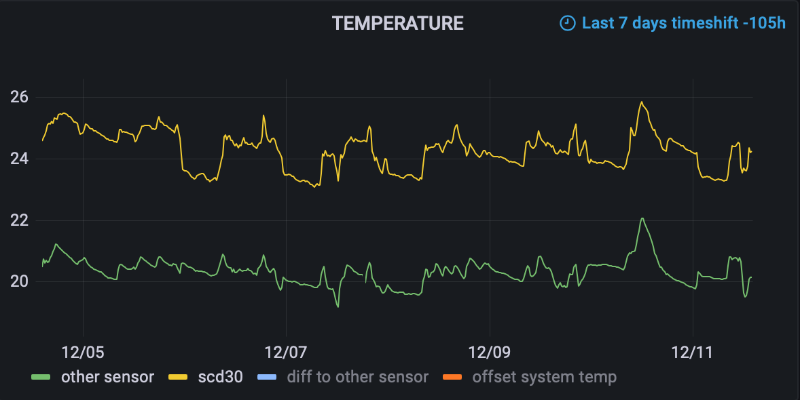
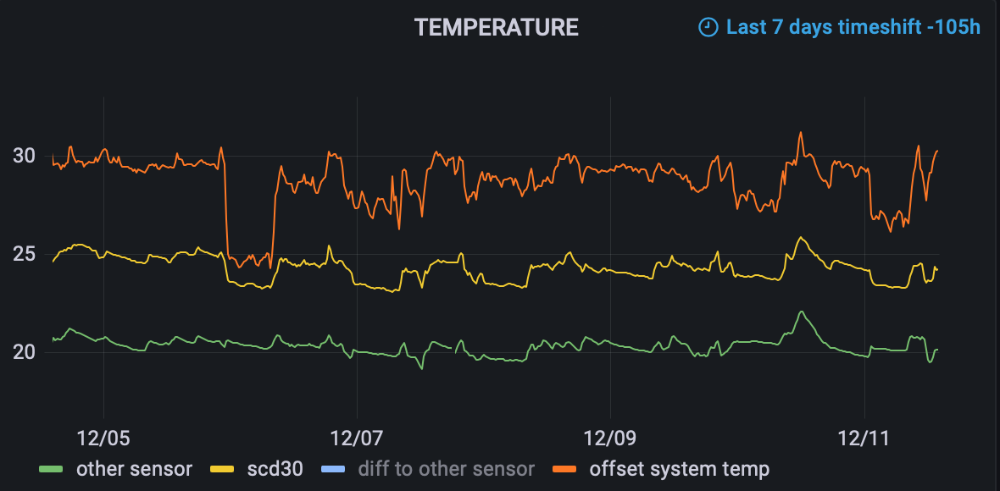
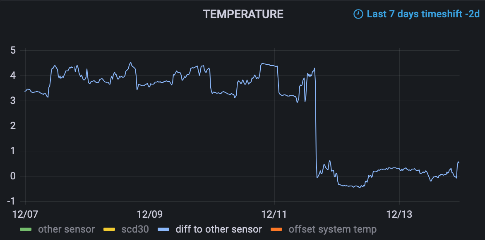
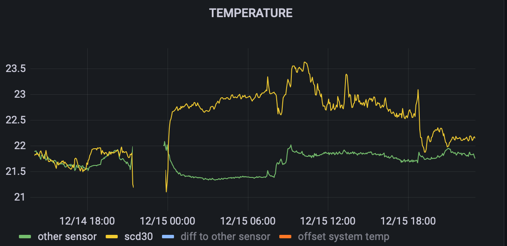

# SCD30

_This guide is written for the [Adafruit SCD-30 - NDIR CO2 Temperature and Humidity Sensor](https://thepihut.com/products/adafruit-scd-30-ndir-co2-temperature-and-humidity-sensor) and assumes you've already connected it your Pi._

## Install dependencies

Snsary doesn't need any extra dependencies to interface with Adafruit sensors.

```bash
# install specific driver for this sensor
pip3 install adafruit-circuitpython-scd30
```

## Add it to your app

Snsary has a single `AdafruitSensor` wrapper that can scrape numerical data from a given Adafruit sensor object. The scraper will pick up all numerical properties on the object, including settings.

```python
import adafruit_bh1750
import board

from snsary.contrib.adafruit import AdafruitSensor

i2c = board.I2C()
scd30 = adafruit_scd30.SCD30(i2c, address=0x61)

...

    sensors=[
        ...
        AdafruitSensor(scd30),
        ...
    ],

...
```

The [examples](https://github.com/adafruit/Adafruit_CircuitPython_SCD30/blob/main/examples/scd30_simpletest.py#L17) for the SCD30 suggest checking the `data_available` property before reading data, which can be done as follows. However, in practice this doesn't seem to make any difference.

```python
    sensors=[
        ...
        AdafruitSensor(scd30, ready_fn=lambda device: device.data_available),
        ...
    ],
```

## Calibrate the SCD30

The SCD30 has several calibration properties.

### [`self_calibration_enabled`](https://github.com/adafruit/Adafruit_CircuitPython_SCD30/blob/f0cf081e407ee9ee25e0a84540cd313f75d24381/adafruit_scd30.py#L130)

Defaults to `True`.

Initially the reported CO2 was much higher when comparing with a trusted CO2 sensor, even when exposed to outdoor air (400ppm) for long periods. After 5-7 days there was a sudden decrease in the difference with the trusted sensor. However, the SCD30 still failed to reach 400ppm.



TODO

### `temperature_offset`

Defaults to `0`.

This is actually a _negative_ offset. It's normal for the measured temperature to be higher than the environment e.g. due to surrounding heat from the Pi itself and other peripherals.

|  |  |
| - | - |
| Comparing with a separate sensor showed the temperature was between 3°C and 4.5°C too high. | Comparing with the Pi temperature showed minimal from other components on the 6th and the 10th. |


|  |  |
| - | - |
| Setting the offset to `4` minimised the discrepancy. It had no noticeable effect on the reported CO2. | Moving underneath a shelf had a significant impact, increasing the reported temperature by about 1°C. |

TODO

### `altitude`

Defaults to `0`.

Testing with an altitude of 20m (parts of London) didn't lead to any significant change in readings.

### `ambient_pressure`

Defaults to `0`.

TODO
